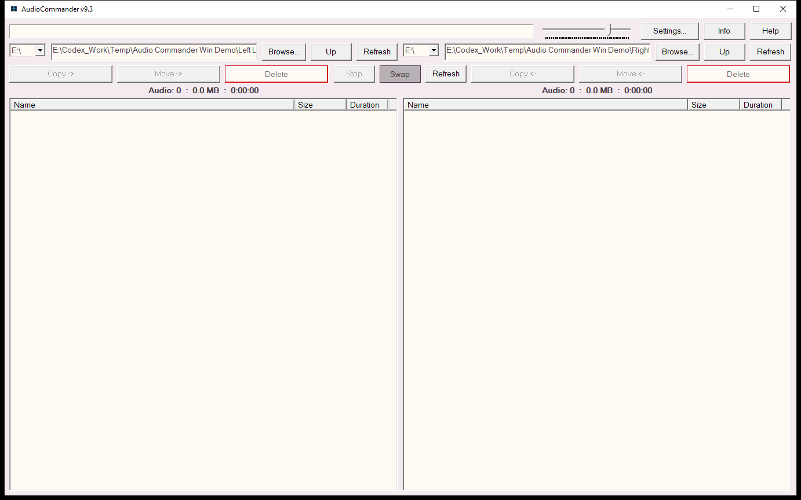

# Audio Commander Win

Latest release: **v9.3**

Audio Commander Win is an experimental portable Windows dual-pane audio file
browser and player written in C11 and Win32.

> **Use at your own risk.** This software is provided as-is, without guarantees
> or warranties. Back up important data and review the source, dependencies,
> permissions, and [full experimental-use notice](EXPERIMENTAL_USE_NOTICE.md)
> before running it.

## Download and run

The ready-to-run files are in [`portable_app_audiocommander_v93`](portable_app_audiocommander_v93).
Download that complete folder, keep its files and `skins` directory together,
and run `audiocommander_v93.exe`. On first launch, the program asks you to
accept the same as-is and use-at-your-own-risk terms; choosing No exits.

No installer is required. The package intentionally ships without an
`audiocommander.ini` file. After acceptance, the program creates that settings
file beside the executable.

## What changed in v9.3

- Large folders appear after fast directory enumeration instead of waiting for
  every file's duration to be read.
- A cancellable background worker fills in audio durations without blocking
  folder navigation.
- Folder changes discard stale metadata work.
- Sorting now uses an O(n log n) merge sort and does not reload the folder.
- The 108-file reported case fell from about four seconds of synchronous work
  per pane to 62-78 ms for immediate enumeration in the verified test runs.

See [README_v93.txt](README_v93.txt) for controls, supported formats, file
safety, portability details, and dependency information. Verification evidence
and remaining live-test boundaries are recorded in
[V93_RESPONSIVENESS_2026_09_10.md](V93_RESPONSIVENESS_2026_09_10.md).

## Privacy and release scope

The repository excludes user audio, settings, logs, caches, private paths, and
all music/audio test files. Corrupt-input tests generate temporary synthetic
bytes during testing and delete them afterward. See
[UPLOAD_SCOPE.md](UPLOAD_SCOPE.md) for the publication boundary.
